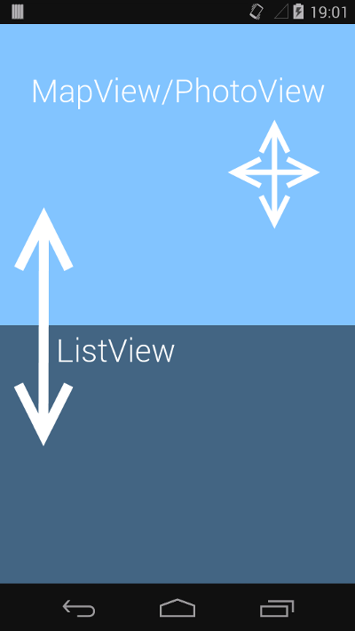
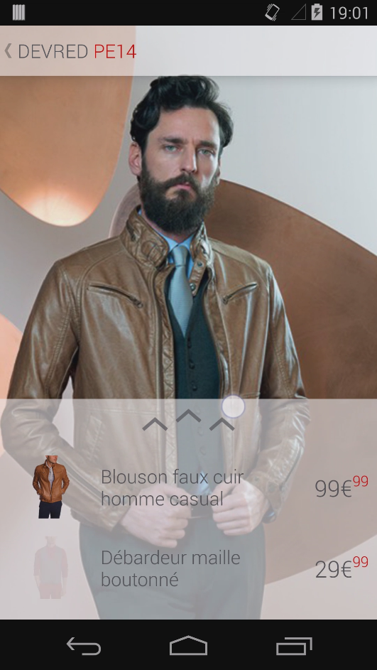

Devred-PE-2014
==============

A small experiment around the [Spring-Summer 2014 Devred Collection](http://www.devred.com/looks-saison-4893.r.html). The motivation behind this application was to develop a list view that can be used over another component that need touch events, like a [MapView](http://developer.android.com/reference/com/google/android/gms/maps/MapView.html) or a [PhotoView](https://github.com/chrisbanes/PhotoView).

Concept and result
==============

To achieve what we wanted to do, we simply set some padding to the top of the ListView and override onTouchEvent so that the method does not handle the motion event if it occurs "above" the first child.

    @Override
    public boolean onTouchEvent(MotionEvent ev) {
        boolean handled = super.onTouchEvent(ev);
        View child = getChildAt(0);
        if (child != null) {
            if (ev.getY() < child.getY()) {
                handled = false;
            }
        }
        return handled;
    }

And that's it! Pretty simple, but we think that's a cool feature to use when the content needs space and touch interactivity at the same time =)

Disclaimer
==============
We are not related to Devred in any form or by any means. We are just using the resources for promoting purpose only and to present our experiment in a real context. If you have any complaints, please contact us at tvbarthel[at]gmail.com

TODO
==============
* Resize drawables.
* Use density-specific resources.
* and much more...

License
=====================
Copyright (C) 2014 tvbarthel

Licensed under the Apache License, Version 2.0 (the "License");
you may not use this file except in compliance with the License.
You may obtain a copy of the License at

    http://www.apache.org/licenses/LICENSE-2.0

Unless required by applicable law or agreed to in writing, software
distributed under the License is distributed on an "AS IS" BASIS,
WITHOUT WARRANTIES OR CONDITIONS OF ANY KIND, either express or implied.
See the License for the specific language governing permissions and
limitations under the License.
